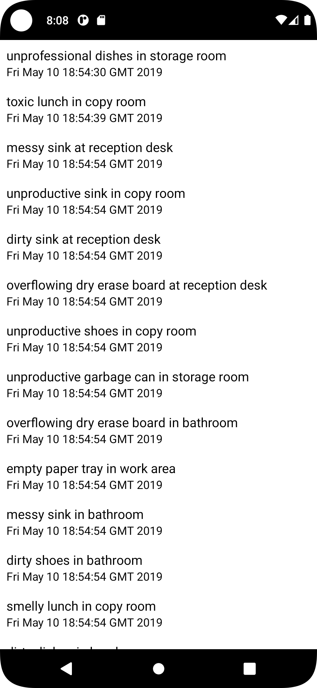

<p align = "center">МИНИСТЕРСТВО НАУКИ И ВЫСШЕГО ОБРАЗОВАНИЯ<br>
РОССИЙСКОЙ ФЕДЕРАЦИИ<br>
ФЕДЕРАЛЬНОЕ ГОСУДАРСТВЕННОЕ БЮДЖЕТНОЕ<br>
ОБРАЗОВАТЕЛЬНОЕ УЧРЕЖДЕНИЕ ВЫСШЕГО ОБРАЗОВАНИЯ<br>
«САХАЛИНСКИЙ ГОСУДАРСТВЕННЫЙ УНИВЕРСИТЕТ»</p>
<br><br><br><br><br><br>
<p align = "center">Институт естественных наук и техносферной безопасности<br>Кафедра информатики<br>Григораш Алексей Владимирович</p>
<br><br><br>
<p align = "center">Лабораторная работа № 10<br><strong>«Базы данных и Room Library, навигация по фрагментам»
</strong><br>01.03.02 Прикладная математика и информатика</p>
<br><br><br><br><br><br><br><br><br><br><br><br>
<p align = "right">Научный руководитель<br>
Соболев Евгений Игоревич</p>
<br><br><br>
<p align = "center">г. Южно-Сахалинск<br>2023 г.</p>
<br><br><br><br><br><br><br><br>

## Введение:
**Android Studio** — интегрированная среда разработки производства Google, с помощью которой разработчикам становятся доступны инструменты для создания приложений на платформе Android OS


## Задачи:

**Упражнение. Ошибка доступа к схеме**

 Если вы посмотрите журналы сборки, вы увидите предупреждение о том, что ваше приложение не предоставляет каталог для экспорта схемы:

warning: Schema export directory is not provided to the annotation processor so we cannot export the schema. You can either provide `room.schemaLocation` annotation processor argument OR set exportSchema to false.

 Схема базы данных — это структура базы данных, а именно: какие таблицы в базе данных, какие столбцы в этих таблицах, а также любые ограничения и отношения между этими таблицами. Room поддерживает экспорт схемы базы данных в файл, чтобы ее можно было хранить в системе управления версиями. Экспорт схемы часто бывает полезен, чтобы иметь разные версии вашей базы данных. 

Предупреждение означает, что вы не указали местоположение файла, где Room мог бы сохранить схему базы данных. Вы можете указать местоположение схемы для аннотации @Database либо отключить экспорт, чтобы удалить предупреждение. Для данного упражнения можно выбрать один из этих вариантов. 
Чтобы указать место для экспорта, нужно указать путь для свойства обработчика аннотаций room.schemaLocation. Для этого добавьте блок kapt{} в файл app/build.gradle: 
```grable
... android { 
... buildTypes { 
... } 
kapt { 
arguments { 
arg("room.schemaLocation", "some/path/goes/here/") 
} 
} 
} ... 
```
Чтобы отключить экспорт, присвойте значение false свойству exportSchema: @Database(entities = [ Crime::class ], version=1, exportSchema = false) @TypeConverters(CrimeTypeConverters::class)
 abstract class CrimeDatabase : RoomDatabase() { abstract fun crimeDao(): CrimeDao }

**Упражнение. Эффективная перезагрузка RecyclerView**

Сейчас, когда пользователь возвращается на экран списка после редактирования преступления, CrimeListFragment заново выводит все видимые преступления в RecyclerView. Это крайне неэффективно, так как в большинстве случаев изменяется всего одно преступление. Обновите реализацию RecyclerView в CrimeListFragment, чтобы заново выводилась только строка, связанная с измененным преступлением. Для этого обновите CrimeAdapter, чтобы расширить его до androidx.recyclingerview.widget. ListAdapter вместо RecyclerView.Adapter. ListAdapter — это RecyclerView.Adapter, который определяет разницу между текущим и новым набором данных и который вы задаете сами. Сравнение происходит в фоновом потоке, поэтому оно не замедляет работу пользовательского интерфейса. Адаптер ListAdapter, в свою очередь, дает команду утилизатору перерисовывать только измененные строки. В ListAdapter используется androidx.recyclingerview.widget.DiffUtil для определения того, какие части набора изменились. Чтобы закончить эту задачу, необходимо добавить реализацию DiffUtil.itemCallback в ваш ListAdapter. Вам также потребуется обновить CrimeListFragment, чтобы отправлять обновленный список преступлений в адаптер утилизатора, а не переназначать адаптер каждый раз, когда вы захотите обновить пользовательский интерфейс. Вы можете отправить новый список, вызвав функцию ListAdapter.submitList(MutableList?), или вы можете настроить LiveData и наблюдать за изменениями. (См. справку по API для androidx.recyclingerview.widget.DiffUtil и androidx. recyclingerview.widget.ListAdapter на developer.android.com/reference/kotlin для получения более подробной информации о том, как использовать эти инструменты.)


## Решение:

### БД: 

### [www.bignerdranch.com/solutions/AndroidProgramming4e.zip](https://www.bignerdranch.com/solutions/AndroidProgramming4e.zip)

### AndroidProgramming4e.zip\11_RoomDatabases\databases


<div align="center">
    
</div>


### database/CrimeDatabase.kt:
```kt
package com.example.criminalintent2.database

import androidx.room.Database
import androidx.room.RoomDatabase
import androidx.room.TypeConverters
import com.example.criminalintent2.Crime

@Database(entities = [ Crime::class ], version=1, exportSchema = false)
@TypeConverters(CrimeTypeConverters::class)
abstract class CrimeDatabase : RoomDatabase() {

    abstract fun crimeDao(): CrimeDao
}
```

### CrimeListFragment.kt:
```kt
package com.example.criminalintent2


import android.os.Bundle
import android.util.Log
import android.view.LayoutInflater
import android.view.View
import android.view.ViewGroup
import android.widget.Button
import android.widget.TextView
import android.widget.Toast
import androidx.fragment.app.Fragment
import androidx.lifecycle.ViewModelProviders
import androidx.lifecycle.Observer
import androidx.recyclerview.widget.DiffUtil
import androidx.recyclerview.widget.LinearLayoutManager
import androidx.recyclerview.widget.ListAdapter
import androidx.recyclerview.widget.RecyclerView

private const val TAG = "CrimeListFragment"

class CrimeListFragment : Fragment() {

    private lateinit var crimeRecyclerView: RecyclerView
    private var adapter: CrimeAdapter? = CrimeAdapter(emptyList())

//    private lateinit var callThePolice: Button

    private val crimeListViewModel: CrimeListViewModel by lazy {
        ViewModelProviders.of(this).get(CrimeListViewModel::class.java)
    }

//    override fun onCreate(savedInstanceState: Bundle?) {
//        super.onCreate(savedInstanceState)
//        Log.d(TAG, "Total crimes: ${crimeListViewModel.crimes.size}")
//    }

    companion object {
        fun newInstance(): CrimeListFragment {
            return CrimeListFragment()
        }
    }

    override fun onCreateView(
        inflater: LayoutInflater,
        container: ViewGroup?,
        savedInstanceState: Bundle?
    ): View? {
        val view = inflater.inflate(R.layout.fragment_crime_list, container, false)
        crimeRecyclerView =
            view.findViewById(R.id.crime_recycler_view) as RecyclerView
        crimeRecyclerView.layoutManager = LinearLayoutManager(context)

//        updateUI()

        crimeRecyclerView.adapter = adapter

        return view
    }

    private fun updateUI(crimes: List<Crime>) {
      //  val crimes = crimeListViewModel.crimes
        adapter = CrimeAdapter(crimes)
        crimeRecyclerView.adapter = adapter
    }


    override fun onViewCreated(view: View, savedInstanceState: Bundle?) {
        super.onViewCreated(view, savedInstanceState)
        crimeListViewModel.crimeListLiveData.observe(
            viewLifecycleOwner,
            Observer { crimes ->
                crimes?.let {
                    Log.i(TAG, "Got crimes ${crimes.size}")
                    updateUI(crimes)
                }
            })
    }

    private inner class CrimeHolder(view: View)
        : RecyclerView.ViewHolder(view), View.OnClickListener {

        private lateinit var crime: Crime

        val titleTextView: TextView = itemView.findViewById(R.id.crime_title)
        val dateTextView: TextView = itemView.findViewById(R.id.crime_date)

        init {
            itemView.setOnClickListener(this)
        }

        fun bind(crime: Crime) {
            this.crime = crime
            titleTextView.text = this.crime.title
            dateTextView.text = this.crime.date.toString()

            // lab 8
//            if(crime.isSeriousCrime){
//                callThePolice = itemView.findViewById(R.id.call_the_police)
//                callThePolice.setOnClickListener{
//                    Toast.makeText(context, "The police is coming!", Toast.LENGTH_SHORT).show()
//                }
//
//            }
        }

        override fun onClick(v: View) {
            Toast.makeText(context, "${crime.title} pressed!", Toast.LENGTH_SHORT)
                .show()
        }

    }

    private inner class CrimeAdapter(var crimes: List<Crime>)
        : ListAdapter<Crime, CrimeHolder>(DiffUtilCallBack()){

        override fun onCreateViewHolder(parent: ViewGroup, viewType: Int)
                : CrimeHolder {

            // lab 8
//            val view = if (viewType == 0) layoutInflater.inflate(R.layout.list_item_crime, parent, false)
//            else layoutInflater.inflate(R.layout.list_item_crime_call_the_police, parent, false)

            val view = layoutInflater.inflate(R.layout.list_item_crime, parent, false)
            return CrimeHolder(view)
        }
        override fun getItemCount() = crimes.size

        override fun onBindViewHolder(holder: CrimeHolder, position: Int) {
            val crime = crimes[position]
//            holder.apply {
//                titleTextView.text = crime.title
//                dateTextView.text = crime.date.toString()
//            }

            holder.bind(crime)
        }

        // lab 8
//        override fun getItemViewType(i: Int): Int {
//            val crime = crimes[i]
//            return if (crime.isSeriousCrime) 1 else 0
//        }

    }

    // lab 10
    private inner class DiffUtilCallBack : DiffUtil.ItemCallback<Crime>() {

        override fun areContentsTheSame(oldItem: Crime, newItem: Crime): Boolean =oldItem == newItem

        override fun areItemsTheSame(oldItem: Crime, newItem: Crime): Boolean = oldItem.id == newItem.id
    }

}
```

### CrimaRepository.kt:
```kt
package com.example.criminalintent2

import android.content.Context
import androidx.lifecycle.LiveData
import androidx.room.Room
import com.example.criminalintent2.database.CrimeDatabase
import java.util.*


private const val DATABASE_NAME = "crime-database"
class CrimeRepository private constructor(context: Context) {

    private val database : CrimeDatabase = Room.databaseBuilder(
        context.applicationContext,
        CrimeDatabase::class.java,
        DATABASE_NAME
    ).build()


    private val crimeDao = database.crimeDao()

    fun getCrimes(): LiveData<List<Crime>> = crimeDao.getCrimes()

    fun getCrime(id: UUID): LiveData<Crime?> = crimeDao.getCrime(id)

    companion object {
        private var INSTANCE: CrimeRepository? = null
        fun initialize(context: Context) {
            if (INSTANCE == null) {
                INSTANCE = CrimeRepository(context)
            }
        }
        fun get(): CrimeRepository {
            return INSTANCE ?:
            throw IllegalStateException("CrimeRepository must be initialized")
        }
    }
}
```


## Вывод:
В ходе выполнения задач изучил RecyclerView.ListAdapter, базы данных, исправил ошибку доступа к схеме и изменил функцию, чтобы перезагружались не все данные, а только те, которые были подвержены изменению